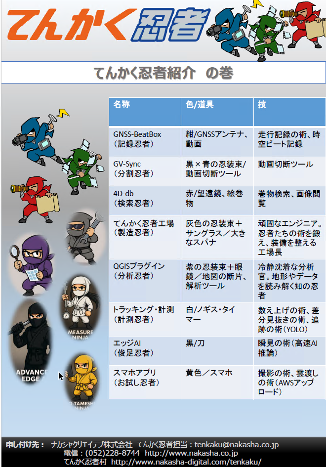

# 🥷 てんかく忍者紹介の巻

Viewer文化の技術は、忍者たちの術として物語化されています。  
この章では、各忍者の役割と対応する技術章を紹介します。

## 忍者と術の対応表

| 忍者名 | 技術章 | 役割 |
|--------|--------|------|
| GNSS-BeatBox（記録忍者） | [13_RealtimeDetection.md](13_RealtimeDetection.md) | 走行記録の術、時空ビート記録 |
| GV-Sync（分割忍者） | [14_RealtimeKPMatching.md](14_RealtimeKPMatching.md) | 動画切断ツール |
| 4D-dbb（検索忍者） | [04_HTMLViewer.md](04_HTMLViewer.md), [06_GenerateMaps.md](06_GenerateMaps.md) | 巻物検索、画像閲覧 |
| てんかく忍者工場（製造忍者） | [09_TenkakuyNinjaFactory](09_TenkakuyNinjaFactory) | 忍者装備の整備 |
| QGISプラグイン（分析忍者） | [10_TenkakuNinjaQGISPlugin](10_TenkakuNinjaQGISPlugin) | 地図解析の術 |
| 計測忍者 | [08_ExportGeoSpatialData.md](08_ExportGeoSpatialData.md) | 数え上げの術、道測の術 |
| 検足忍者（エッジAI） | [13_RealtimeDetection.md](13_RealtimeDetection.md) | 高速AIによる瞬足の術 |
| お試し忍者（スマホ） | [07_ShredMySelf.md](07_ShredMySelf.md) | 撮影とクラウド連携の術 |

---

## 🪄 忍者たちの物語は続く…

この章は Viewer文化の入口です。  
各忍者の術を辿りながら、技術章へと進んでください。  
「目的をひとつにする間、協力こそが推進力！」──それが我らの合言葉です。
